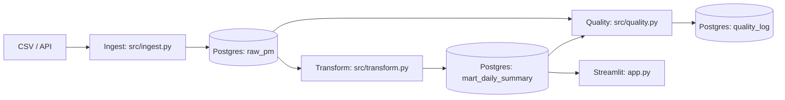

# daejeon-air-pm-2025h1

A repository for an end-to-end data engineering mini-project analyzing particulate matter (PM) levels in Daejeon during the first half of 2025.

Pipeline overview:

**Ingest (CSV/API) → PostgreSQL (raw) → Transform (mart) → Data quality checks → Streamlit dashboard**

Status: In progress.

## Goal

Extract, transform, load, and visualize the PM data.

## File description

- `2025년 대전광역시 상반기 미세먼지 현황.pdf`: Official report on particulate matter (PM) levels in Daejeon during the first half of 2025.

## Architecture

## Source

https://www.data.go.kr/data/15073477/fileData.do

(Redirects to https://www.daejeon.go.kr/hea/board/boardNormalView.do?boardId=HEA_normal_003&menuSeq=951&pageIndex=1&ntatcSeq=1487017088)
