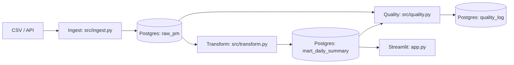
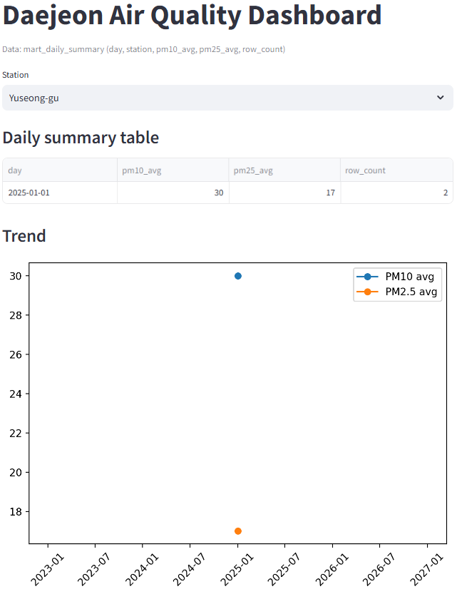

# daejeon-air-pm-2025h1

A repository for an end-to-end data engineering mini-project analyzing particulate matter (PM) levels in Daejeon during the first half of 2025.

Status: v0.1 MVP released (2025-12-22).

What works: ingest → raw → mart → quality_log → dashboard (reproducible via Quickstart).

Next: add 5–8 quality rules doc + 3 unit tests + CI badge detail.

## Quickstart (Windows CMD)

```cmd
copy .env.example .env
py -m venv .venv
.venv\Scripts\activate.bat
py -m pip install -r requirements.txt
docker compose up -d
py -m src.ingest data\sample_air_quality.csv
py -m src.transform
py -m src.quality
streamlit run app.py
```

## Goal

Extract, transform, load, and visualize the PM data.

## Architecture



## Pipeline

**Ingest (CSV/API) → PostgreSQL (raw) → Transform (mart) → Data quality checks → Streamlit dashboard**

## Source

https://www.data.go.kr/data/15073477/fileData.do

(Redirects to https://www.daejeon.go.kr/hea/board/boardNormalView.do?boardId=HEA_normal_003&menuSeq=951&pageIndex=1&ntatcSeq=1487017088)

## Demo

Demo with the sample data:



## File description

- `2025년 대전광역시 상반기 미세먼지 현황.pdf`: Official report on particulate matter (PM) levels in Daejeon during the first half of 2025.
